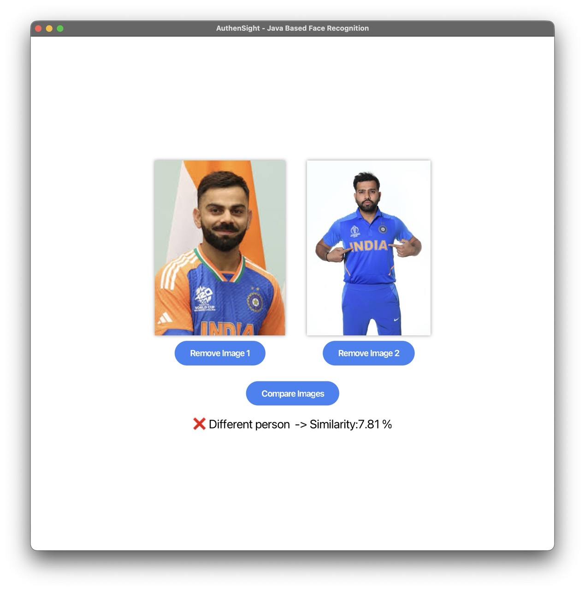
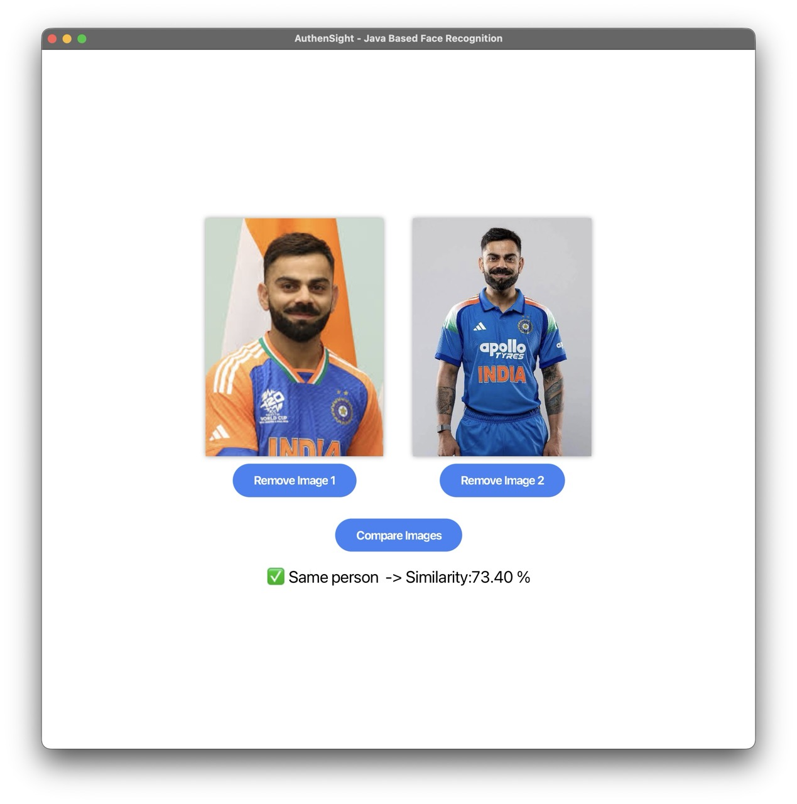

# AuthenSight

> AuthenSight is a Java-based face recognition system designed for one-to-one face comparison. Its primary purpose is to verify identities by matching a captured facial image against a specific reference face. It solves the problem of secure, efficient authentication in applications like access control or user verification, reducing reliance on passwords or manual checks.

---
### Sample Screen Shots

<div align="center">
  
</div>

<div align="center">
  
</div>  

## 📋 Prerequisites

Before you begin, ensure you have met the following requirements:

* **Java Development Kit (JDK):** Version `<17>` or higher.
    * *To check your version, run: `java -version`*
* **Build Tool:** `Maven`.
* **IDE:** IntelliJ IDEA (Below provided info is for IntelliJ IDEA).

---

## 🚀 Getting Started

### 1. Clone the repository

```bash
git clone https://github.com/s16exe/Authen-Sight-Java.git
cd Authen-Sight-Java
```

### 2. Download Required Resources

The project requires specific assets to run successfully. Please download the necessary files from the Google Drive links below:

* [Drive Link that contains - Model, Face Detection XML, Sample Pictures 🔗](https://drive.google.com/drive/folders/12mBaoj5M6S2WOT518rzAD3LJ7dfj4WCK?usp=sharing)
* [JavaFX SDK Official Download Page 🔗](https://gluonhq.com/products/javafx/)

#### 2.1 Move files downloaded from drive to resources directory
Once the files are downloaded from the drive link, move it to `src/main/resources` directory of the project.

You can do this manually or via the terminal:

```bash
# Move your downloaded files into the resources folder (adjust the path as needed)
mv ~/Downloads/<downloaded-file-name> <project-cloned-path>/src/main/resources
```

#### 2.2 Download and Extract JavaFX SDK 

From JavaFX Official Page, Download SDK for your Operating System.

Once downloaded, extract it in the root directory of the project (Its better this but, you can extract anywhere). 


### 3. Run Configuration in IDEA

Click on the following:

* `Run` from top bar  
* `Edit Configurations`  
* `+` 
* `Applications`  
* `VM Options` if not present, Click on `Modify Options` and tick on `VM Options`  
* Add the following in `VM Option Text Area`, **Note: make sure to enter complete path   
```bash
--module-path <complete-path-to-javafx-sdk>/lib --add-modules javafx.controls,javafx.fxml
```
* `Apply` this changes  
* `Run this custom configuration`


### Program should run successfully

### With Some modifications, you can make this project compare one-to-n face images 
Modifications :   
* Embeddings generated for n faces, can be stored in in-memory list (Volatile) or json file (Non Volatile).   

You can then compare new face image's embeddings with stored `n` face embeddings 
